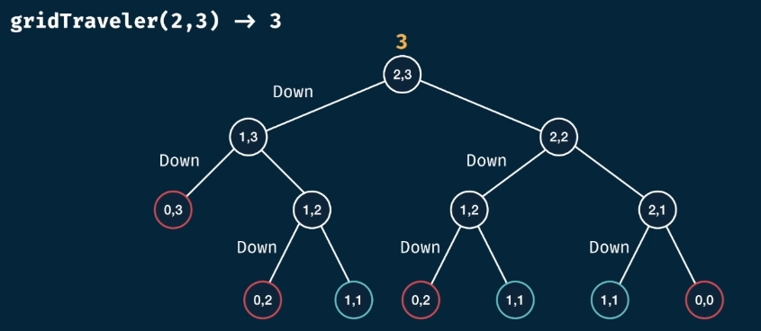

# 出题
参考 https://www.cnblogs.com/qyf2199/p/12104922.html
## 题目
四、设计题/实践题(50 分)

阅读如下材料，以此为背景，完成后面的要求。

材料：
学校图书馆的各类藏书数量以及的库存量临界值等数据记录在库存清单主文件中，各类书籍摆放在书架上。需要借书时，通过条码或二维码查找书籍所在书架，给出当前所在位置到需要借阅的图书位置导航路线。读者借书还书时，系统都需要验证读者身份的有效性。图书需要图书管理员根据系统给出的导航信息进行手动出入库。
现在假设你是该图书管理系统的项目负责人，请完成以下任务：

1. 画出 UML 用例图，并做简要说明。
2. 现假设该系统的导航功能基于二维栅格模型，现在请分析这样一个导航子问题：（gridTraveler）需要我们解决：假设你有一个 m*n 的二维栅格，且只能向右或向下移动，现在我们需要统计从格网的左上角至格网右下角的所有可能路径的总数。

    

> 例如： 2*3 的格网中，你一共有三种走法，即：右-右-下，右-下-右，下-右-右

下面给出该算法的 JavaScript 代码（递归版本），请分析并画出该问题递归调用树,并给出该方法的时间复杂度及空间复杂度。

   - 输入：gridTraveler = (2 ,3)
   - 输出：3

```js
// 例子二 gridTraveler(m, n)
const gridTraveler = (m ,n) =>{
    if(m === 1 && n === 1) return 1;
    if(m === 0 || n === 0) return 0;

    const res = gridTraveler(m - 1, n, memo) + gridTraveler(m, n -1, memo);
    return res;
}
```
1. 给出上述代码的测试用例，并指出上述代码的不足之处。（提示，考虑第二个问题中的复杂度）
---

## 参考答案
四、实践题/设计题（共50分）

1. 正确画出 UML 用例图，并给出关键用例说明（15分）


    


   - 关键点：（满足任意三项关键点，并有必要说明，该部分满分。无说明至多 10 分）
      - 借还图书需要验证读者身份
      - 图书出入库都需要获取导航信息（图书位置信息）
      - 系统主要使用者（客户）位于左侧，系统的次要用户（管理员）位于右侧
      - 用户与直接相关的用例使用实线连接
      - 用例使用虚线箭头指向其依赖用例。（说明：例如，每次借阅图书都需要验证读者的身份并出库。借阅图书用例会自动产生验证读者信息及图书出库用例）
2. 导航子问题分析（25分）
    - （画出递归树可得 20 分）
    - （若未画出树，但写出任意一个复杂度可得15分）
    - 递归树：15 分
    
    - 时间复杂度：5 分
        $$O(2^{m+n})$$
    - 空间复杂度：5 分
        $$O(m+n)$$

3. 测试用例（10分）
- 不必拘泥于语言，只要给出测试用例即可（5 分）
```js
// test
console.log(gridTraveler(1,1)); // 1
console.log(gridTraveler(2,3)); // 3
console.log(gridTraveler(3,2)); // 3
console.log(gridTraveler(3,3)); // 6
console.log(gridTraveler(18,18)); // 2333606220
```
- 指出该问题时间复杂度指数级增长，不适合大规模数据的计算（5分）