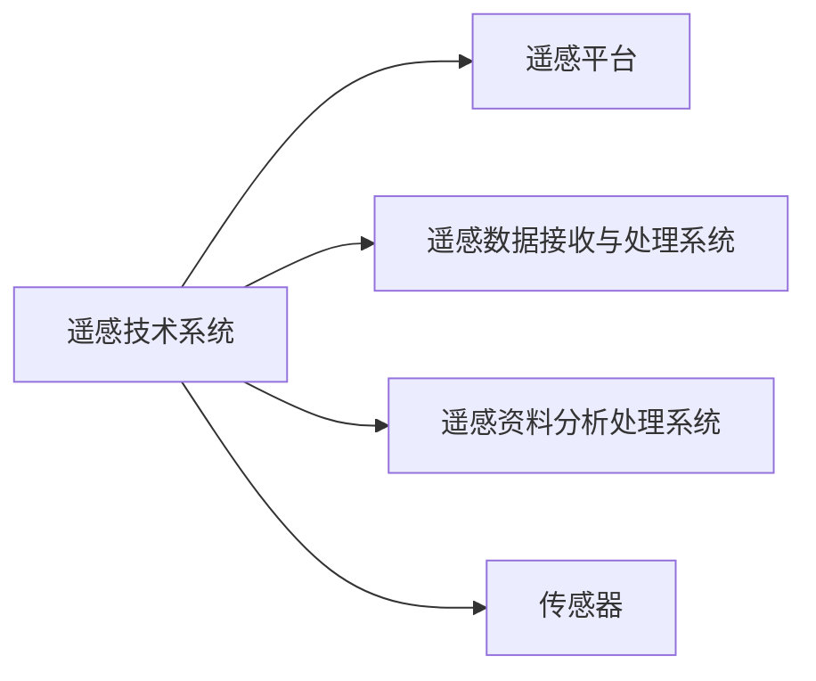
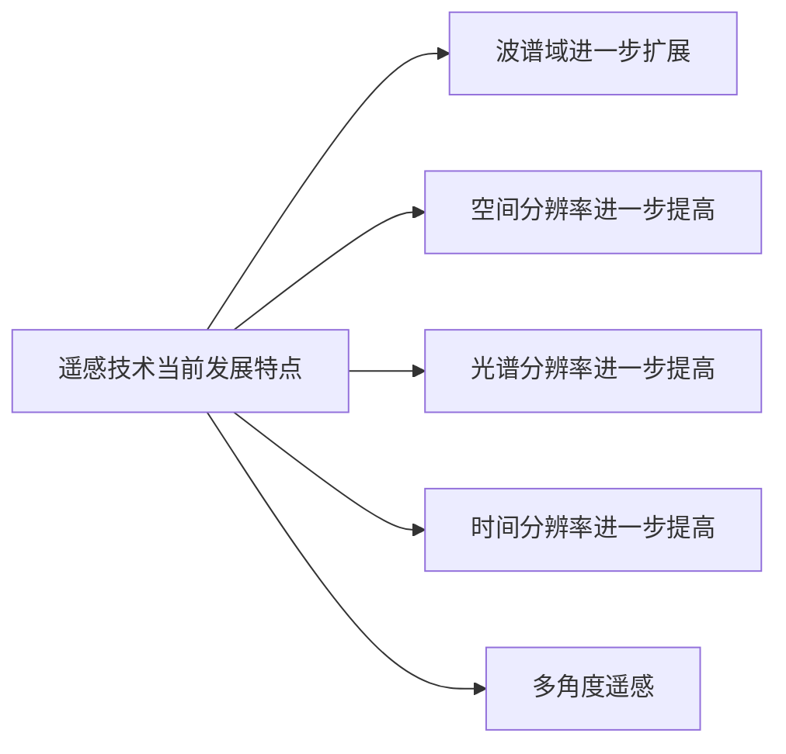
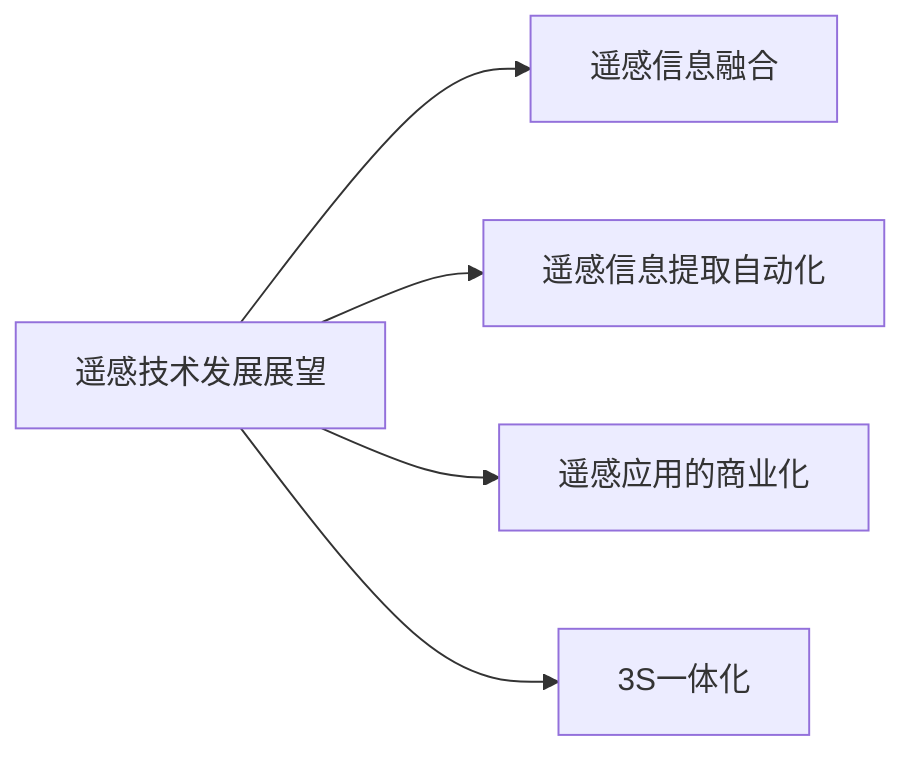
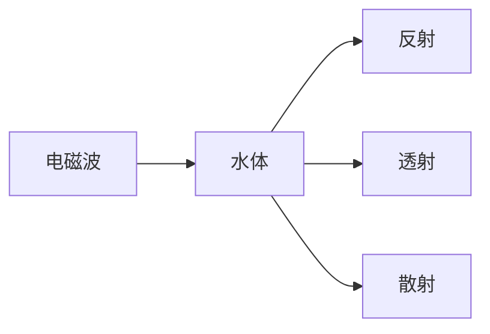
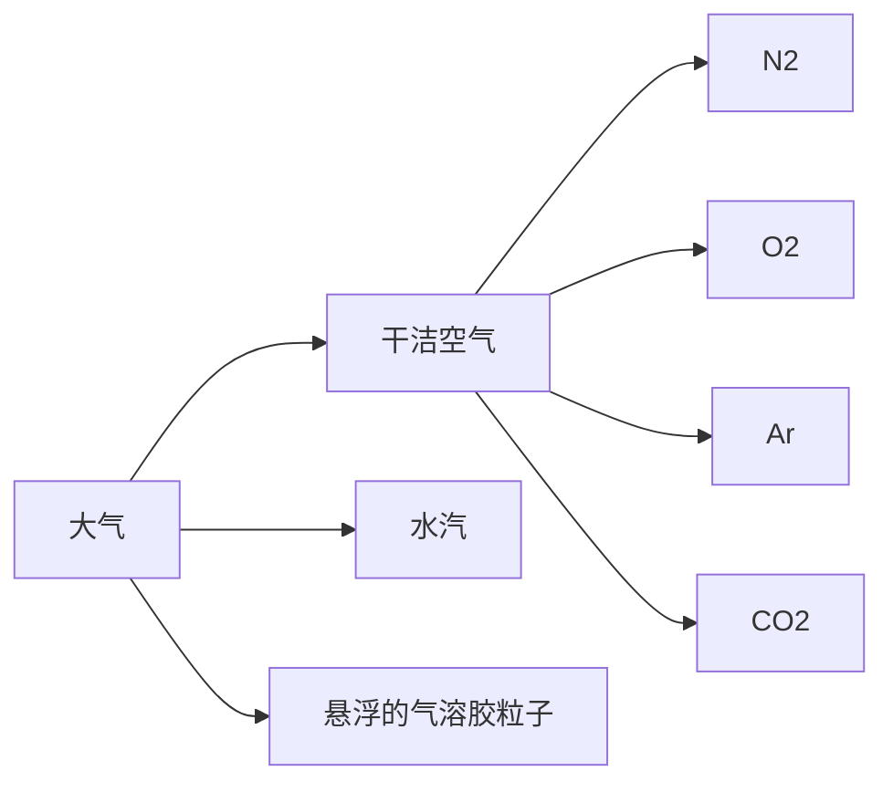

# 遥感地学分析复习资料

## Table of contents
- [遥感地学分析复习资料](#遥感地学分析复习资料)
  - [Table of contents](#table-of-contents)
  - [第一讲 绪论](#第一讲-绪论)
    - [名词解释](#名词解释)
      - [遥感定义:](#遥感定义)
      - [遥感地学分析的概念:](#遥感地学分析的概念)
      - [反射率:](#反射率)
      - [透射率:](#透射率)
      - [地物反射光谱:](#地物反射光谱)
      - [黑体:](#黑体)
      - [`发射率`:](#发射率)
    - [问答题](#问答题)
      - [遥感探测系统包括哪些部分？](#遥感探测系统包括哪些部分)
      - [我国遥感发展的特点:](#我国遥感发展的特点)
      - [当前遥感发展主要特点与展望:](#当前遥感发展主要特点与展望)
      - [主要特点:](#主要特点)
      - [展望:](#展望)
      - [如何理解传感器的辐射分辨率、光谱分辨率、空间分辨率、时间分辨率？](#如何理解传感器的辐射分辨率光谱分辨率空间分辨率时间分辨率)
      - [当前用的遥感系统有哪些？主要的陆地资源卫星有哪些？](#当前用的遥感系统有哪些主要的陆地资源卫星有哪些)
      - [当前常用的遥感系统分三类](#当前常用的遥感系统分三类)
      - [主要的陆地资源卫星:](#主要的陆地资源卫星)
      - [遥感研究需解决的问题](#遥感研究需解决的问题)
      - [列举几种典型地物反射光谱特征](#列举几种典型地物反射光谱特征)
      - [什么是黑体？](#什么是黑体)
      - [根据发射率与波长的关系,简述地物类型的划分依据？](#根据发射率与波长的关系简述地物类型的划分依据)
      - [简述目视解译的概念,并说出目视解译与计算机解译之间的区别.](#简述目视解译的概念并说出目视解译与计算机解译之间的区别)
      - [什么是解译标志？](#什么是解译标志)
      - [有哪些解译标志,这些解译标志中哪些是直接解译标志,哪些是间接解译标志](#有哪些解译标志这些解译标志中哪些是直接解译标志哪些是间接解译标志)
  - [第二讲 遥感信息提取](#第二讲-遥感信息提取)
    - [名词解释](#名词解释-1)
      - [什么是K-L变换,其主要有哪些步骤？](#什么是k-l变换其主要有哪些步骤)
      - [什么是监督分类？](#什么是监督分类)
      - [光谱特征:](#光谱特征)
      - [光谱特征分析:](#光谱特征分析)
      - [光谱特征选择:](#光谱特征选择)
    - [简答题](#简答题)
      - [大气校正(ENVI: FLAASH 模块)是什么？有哪几种方法？简述这些方法.](#大气校正envi-flaash-模块是什么有哪几种方法简述这些方法)
      - [简述几何精校正中控制点的选取要点？](#简述几何精校正中控制点的选取要点)
      - [地物的光谱特征包括哪几方面？](#地物的光谱特征包括哪几方面)
      - [简述典型植被地物类型的反射光谱特征](#简述典型植被地物类型的反射光谱特征)
      - [简要说明遥感图像光谱与地物光谱的区别与联系](#简要说明遥感图像光谱与地物光谱的区别与联系)
      - [常用的光谱特征分析的方法有哪些？](#常用的光谱特征分析的方法有哪些)
      - [良好的特征应该具有哪些特点？](#良好的特征应该具有哪些特点)
      - [有哪三种进行光谱特征选择的度量方法？](#有哪三种进行光谱特征选择的度量方法)
  - [第三讲 植被遥感](#第三讲-植被遥感)
    - [名词解释](#名词解释-2)
      - [红边:](#红边)
      - [红移：](#红移)
      - [蓝移：](#蓝移)
      - [比值植被指数(RVI):](#比值植被指数rvi)
      - [归一化植被指数(NVI):](#归一化植被指数nvi)
      - [叶面积指数（LAI,也叫植土比）:](#叶面积指数lai也叫植土比)
      - [叶干生物量（DM）:](#叶干生物量dm)
      - [垂直植被指数(PVI):](#垂直植被指数pvi)
    - [简答题](#简答题-1)
      - [健康植物的光谱特征是什么？ 0.55μm 0.45μm和0.65μm 0.7~0.8μm 0.8~1.3μm 1.45μm,1.95μm和2.6~2.7μm](#健康植物的光谱特征是什么-055μm-045μm和065μm-0708μm-0813μm-145μm195μm和2627μm)
      - [影响植物光谱特征的因素有哪些？](#影响植物光谱特征的因素有哪些)
      - [简述绿色植物是绿色的原因？](#简述绿色植物是绿色的原因)
      - [不同种类植被的光谱特征有何差异？](#不同种类植被的光谱特征有何差异)
      - [简述比值植被指数的特性.](#简述比值植被指数的特性)
      - [简述归一化植被指数的特点.(`NDVI`)](#简述归一化植被指数的特点ndvi)
      - [植被指数与植被盖度的关系？](#植被指数与植被盖度的关系)
      - [简述植被遥感的主要研究内容？](#简述植被遥感的主要研究内容)
      - [森林关键参数有哪些？](#森林关键参数有哪些)
  - [第四讲 城市遥感](#第四讲-城市遥感)
    - [名词解释](#名词解释-3)
    - [简答题](#简答题-2)
      - [遥感监测城市扩张的原理与方法](#遥感监测城市扩张的原理与方法)
      - [归一化建筑用地指数的计算公式及特点(NDBI)](#归一化建筑用地指数的计算公式及特点ndbi)
      - [土地利用、土地覆盖的基本概念是什么？](#土地利用土地覆盖的基本概念是什么)
      - [土地利用调查的一般步骤有哪些？各需要注意什么？](#土地利用调查的一般步骤有哪些各需要注意什么)
      - [土地覆盖研究方法有哪些？](#土地覆盖研究方法有哪些)
      - [研究`碳循环`的主要遥感信息源有哪些？](#研究碳循环的主要遥感信息源有哪些)
  - [第五讲 土壤(地质)遥感](#第五讲-土壤地质遥感)
    - [名词解释](#名词解释-4)
      - [湿地：](#湿地)
      - [滑坡(或称“岩滑”):](#滑坡或称岩滑)
      - [滑坡体:](#滑坡体)
      - [泥石流:](#泥石流)
    - [简答题](#简答题-3)
      - [遥感影像直接估算碳储量](#遥感影像直接估算碳储量)
      - [植被指数估算碳储量方法](#植被指数估算碳储量方法)
      - [地质解译的目的与要求是什么？](#地质解译的目的与要求是什么)
      - [地质解译标志有哪些？在地质解译中它们各有什么作用？](#地质解译标志有哪些在地质解译中它们各有什么作用)
      - [滑坡、泥石流调查的主要方法有哪些？各有什么特点？](#滑坡泥石流调查的主要方法有哪些各有什么特点)
      - [土壤的光谱特征是什么？](#土壤的光谱特征是什么)
      - [土壤遥感分析方法](#土壤遥感分析方法)
      - [利用遥感技术进行土壤调查的技术路线是什么？](#利用遥感技术进行土壤调查的技术路线是什么)
  - [第六讲 水体遥感](#第六讲-水体遥感)
    - [名词解释](#名词解释-5)
      - [离水辐亮度：](#离水辐亮度)
      - [水色：](#水色)
      - [一类水体:](#一类水体)
      - [二类水体:](#二类水体)
      - [水深:](#水深)
      - [衰减长度:](#衰减长度)
      - [辐照度:](#辐照度)
      - [反射率:](#反射率-1)
    - [简答题](#简答题-4)
      - [简述电磁波与水体的相互作用过程.](#简述电磁波与水体的相互作用过程)
      - [简述清洁水体的光学特性](#简述清洁水体的光学特性)
      - [水色三要素](#水色三要素)
      - [简述水体光谱信号的组成,以及典型的含藻水体和浑浊水体的光谱特征](#简述水体光谱信号的组成以及典型的含藻水体和浑浊水体的光谱特征)
      - [简述水环境遥感的基本原理](#简述水环境遥感的基本原理)
      - [遥感在水资源方面的应用主要包括哪些内容？](#遥感在水资源方面的应用主要包括哪些内容)
      - [如何应用遥感方法探测水深？](#如何应用遥感方法探测水深)
      - [举出几个使用遥感方法进行水域变化监测的分析实例.](#举出几个使用遥感方法进行水域变化监测的分析实例)
      - [水体信息提取的常用方法](#水体信息提取的常用方法)
      - [请谈一下海洋一号（ＨＹ-1）在我国海洋环境研究方面的应用.](#请谈一下海洋一号ｈｙ-1在我国海洋环境研究方面的应用)
  - [第七讲 大气遥感](#第七讲-大气遥感)
    - [名词解释](#名词解释-6)
      - [大气气溶胶:](#大气气溶胶)
      - [被动式大气遥感：](#被动式大气遥感)
      - [主动式大气遥感：](#主动式大气遥感)
    - [简答题](#简答题-5)
      - [大气的主要组成气体有哪些？](#大气的主要组成气体有哪些)
      - [什么是大气气溶胶,它的分布特征是怎样的？](#什么是大气气溶胶它的分布特征是怎样的)
      - [对地观测卫星大气圈探测主要有哪些方面？各有什么意义？](#对地观测卫星大气圈探测主要有哪些方面各有什么意义)
      - [臭氧的吸收带范围主要有哪些？](#臭氧的吸收带范围主要有哪些)
      - [大气窗口对于遥感探测的重要意义.](#大气窗口对于遥感探测的重要意义)
      - [大气成分遥感监测的原理？](#大气成分遥感监测的原理)
      - [如何利用吸收和散射特性进行大气遥感？](#如何利用吸收和散射特性进行大气遥感)

## 第一讲 绪论
### 名词解释
#### 遥感定义:
* 是指从`远离地面的`不同`工作平台`上(气球、飞机、人造卫星、航天飞机)
* 通过`传感器`对地球表面的`电磁波信息`进行探测,并经信息的传输、处理和判读分析
* 实现研究地物空间形状、位置、性质及其与环境的相互关系的`一门现代应用技术科学`

#### 遥感地学分析的概念:
* 以`地学规律`为基础对遥感信息进行的分析处理过程,是地学分析方法与遥感图像处理方法的`有机结合`
* 一方面可扩大`地学`研究的视域,提高对区域的认识水平
* 另一方面可改善`遥感`分析、处理、识别的精度

#### 反射率:
- 物对某一波段电磁波的`反射能量与入射的总能量之比`,用ρ表示.反射率是地物反射光谱的基本特征之一.
#### 透射率:
- 透射能量的能力,用透射率τ来表示.透射率就是`入射光透射过地物的能量与入射总能量的百分比`.地物的透射率随着电磁波的波长和地物的性质而不同.
#### 地物反射光谱:
- 地物的反射率`随入射波长变化的规律`,叫做地物反射光谱
#### 黑体:
- 一个理想的辐射体,是“绝对黑体”的简称,指在任何温度下,对各种波长的电磁辐射`全部吸收`.
#### `发射率`:
- 发射率是指物体单位面积单位时间内发射的辐射能量与单位面积单位时间内黑体发射的辐射能量之比,即发射率是物体发射的辐射能量与黑体发射的辐射能量之比.
### 问答题
#### 遥感探测系统包括哪些部分？

#### 我国遥感发展的特点:
* `国家`的重视和支持,为遥感的快速发展奠定了基础
* 集中人力、物力重点`攻关`,重点突破
* 全国性、大`区域遥感工程`的完成,充分显示了我国遥感的特色和水平

#### 当前遥感发展主要特点与展望:
#### 主要特点:

* `波谱域进一步扩展` 波段范围扩展:从可见光、近红外、发展到中远红外、微波.

> - 随着热红外成像、机载多极化合成孔径雷达、高分辨力表层穿透雷达和星载合成孔径雷达`技术日益成熟`
> - 遥感`波谱域`从最早的可见光向近红外、短波红外、热红外、微波方向`发展`
> - 波谱域的扩展将`进一步适应`各种物质反射、辐射波谱的特征峰值波长的宽域分布

* `空间分辨率进一步提高` 空间分辨率提高:从1km、500m、250m、80m、30m、20m、10m、5m发展到1m、亚米,军事侦察卫星传感器可达到15cm或者更高的分辨率.(高空间分辨力新型传感器的应用)
* `光谱分辨率进一步提高` 光谱分辨率提高:从0.4μm(黑白摄影)、0.1 μm(多光谱扫描)到5nm(成像光谱仪).光谱分辨率越来越高.
> - 遥感器波段宽度窄化,针对性更强,可以突出特定地物反射峰值波长的微小差异
> - 同成像光谱仪等的应用,提高了地物光谱分辨力,有利于区别各类物质在不同波段的光谱响应特性.
* `时间分辨率进一步提高` 时间分辨率提高:从几分钟到18天不等.时间分辨率越来越高.(大、中、小卫星相互协同,高、中、低轨道相结合)
* `多角度遥感` 机载三维成像仪和干涉合成孔径雷达的发展和应用,将地面目标由二维测量为主发展到三维测量.多角度遥感的发展,将地面目标由二维测量为主发展到三维测量.
#### 展望:

* `遥感信息融合` 遥感信息融合:将多源、多时相、多分辨率、多波段的遥感数据进行融合,以提高遥感数据的信息量和信息质量,是遥感技术发展的一个重要方向.
* `遥感信息提取自动化` 遥感信息提取自动化:遥感图像自动解译的专家系统,逐步实现遥感图像专题信息提取自动化.
* `遥感应用的商业化` 遥感应用的商业化:遥感技术的商业化,是遥感技术发展的一个重要方向.
* `3S一体化` 3S一体化:遥感、地理信息系统(GIS)和全球定位系统(GPS)的融合,是遥感技术发展的一个重要方向.
* `定性到定量` 遥感分析技术从“定性”向“定量”转变,定量遥感成为遥感应用的发展热点.遥感从定性到定量分析

#### 如何理解传感器的辐射分辨率、光谱分辨率、空间分辨率、时间分辨率？

* `辐射分辨率`: 
* 指传感器对光谱信号强弱的敏感程度、区分能力
* 即探测器的灵敏度(遥感器感测元件在接收光谱信号时能分辨的最小辐射度差,或指对两个不同辐射源的辐射量的分辨能力)
* 一般用灰度的分级数来表示,即最暗—最亮灰度值(亮度值)间分级的数目——量化级数

* `光谱分辨率`: 
* 指传感器所选用的波段数量的多少、各波段的波长位置、及波长间隔的大小(带宽)
* 波长范围越窄,光谱分辨率越高;
* 波段数越多,光谱分辨率越高

* `空间分辨率`: 
* 是表征图像分辨地面目标细节能力的指标.
* 像元大小:针对传感器或像而言,指图像上能够详细区分的最小单元的尺寸或大小.
* 地面分辨率:针对地面而言,指可以识别的最小地面距离或最小目标物的大小.

* `时间分辨率`: 
* 是对同一地区遥感影像重复覆盖的频率.
* 对动态监测与预报、自然历史变迁和动力学分析、利用时间差提高遥感的成像率和解像率、更新数据库等有重要意义.

#### 当前用的遥感系统有哪些？主要的陆地资源卫星有哪些？
#### 当前常用的遥感系统分三类
* 卫星遥感系统
* 航空遥感系统
* 地面遥感数据采集系统
#### 主要的陆地资源卫星:
| 卫星名称 | 发射国家 | 英文缩写 |
| :---: | :---: | :---: |
| 美国陆地卫星 | 美国 | Landsat |
| 法国陆地观测卫星 | 法国 | SPOT |
| 欧空局地球资源卫星 | 欧洲 | ERS |
| 俄罗斯钻石卫星 | 俄罗斯 | ALMAZ |
| 日本地球资源卫星 | 日本 | JERS |
| 印度遥感卫星 | 印度 | IRS |
| 中-巴地球资源卫星 | 中巴 | CBERS |

#### 遥感研究需解决的问题

1. 海量数据:有效存储、管理、分发、使用
2. 数据融合与压缩、识别
3. 定量遥感、新型数据处理
4. 国际合作
5. 高分辨率影像问题

#### 列举几种典型地物反射光谱特征
* 岩石:岩石的反射光谱特征是地质遥感的基础,不同的矿物成分、矿物含量、风化程度、含水状况、颗粒大小、表面的光滑程度、色泽等都会影响到其反射波谱特征.
* 土壤:自然状况的土壤表面的反射率没有明显的峰值和谷值.一般来说,土质越细反射率越高,有机质含量和含水量越高反射率越低.此外土壤的肥力也会对反射率产生影响.
* 水体:水体的反射主要在蓝光波段,其他波段吸收都很强,特别在近红外以后水体便成为一个吸收体.
* 植被:植被的反射波谱特征曲线规律明显而独特,主要分为三个波段.
  * 可见光(0.4~0.76μm)波段有一小的反射峰,位于0.55μm的绿光波段处,其两侧蓝光波段0.45μm和红光波段0.67μm处为两个吸收带.
  * 近红外(0.7~0.8μm)波段有一反射陡坡,在1.1μm附近有一峰值.
  * 中红外(1.3~2.5μm)波段受绿色植物含水量的影响,吸收率大增,反射率下降,在1.45μm、1.95μm和2.7μm为中心是水的吸收带,形成低谷.

#### 什么是黑体？
黑体是一个理想的辐射体,是“绝对黑体”的简称,指在任何温度下,对各种波长的电磁辐射全部吸收.

#### 根据发射率与波长的关系,简述地物类型的划分依据？
  * 黑体:发射率ελ=1,即黑体发射率对所有波长都是 `一个常数`,并且等于1.
  * 灰体:发射率ελ=常数＜1.即灰体的发射率始终小于1,发射率ελ`不随波长变化`.
  * 选择性辐射体:发射率ελ＜1, 发射率ελ`随波长而变化`.

#### 简述目视解译的概念,并说出目视解译与计算机解译之间的区别.
* 目视解译是指用肉眼或借助于简单的工具如放大镜、立体镜、投影观察器等,直接`由肉眼来识别图像特性`,从而提取有用信息,即人把物体与图像联系起来的过程.
  * `pros`: 目视解译的优点是可以综合运用各种地理学知识,识别特定的地理现象,
  * `cons`: 但其缺点是速度慢,效率低,只能处理少量数据.
* 计算机解译的优点是速度快效率高,可以处理海量数据,其却缺点是不能综合运用地理学知识,识别特定的地理现象.

#### 什么是解译标志？
* 解译标志又称判读标志,是指能够反映和表现目标地物信息的遥感影像各种特征,这些 特征能帮助判读者识别遥感图像上目标地物或现象,解译标志分为直接判读标志和间接判读标志.

#### 有哪些解译标志,这些解译标志中哪些是直接解译标志,哪些是间接解译标志
* 直接解译标志包括:
* 色调,色调是识别目标地物的基本依据.由于地物属性的差别,在遥感图像上表现出色调上的差别.一般来说由于人眼的局限性,在图像可分出16个灰度级.
* 颜色,由于目标地物在不同波段中反射或发射电磁辐射能量的差异性,由此而表现在彩色图像颜色的差异性.颜色也是目视解译的基本标志之一.
* 图型,目标地物有规律排列而成的图形结构.
* 阴影,阴影是遥感图像上由于电磁辐射能量被遮挡而产生的辐射能量减弱.由于阴影的存在,可据此地物的性质或高度,应注意的是阴影的形状与大小受到辐射能量入射角的影响.
* 形状,是指目标地物在遥感影像上呈现的外部轮廓.由于不同地物的顶视平面的差异,可据此判断目标地物的性质.
* 纹理,是指遥感图像中目标地物内部色调有规则变化造成的影像结构.
* 大小,指遥感图像上目标地物的形状、面积与体积的度量关系.是遥感图像上测量目标地物最重要的数量特征之一.同时根据其大小可以推断地物的属性.
* 间接解译标志包括:
* 位置,指目标地物分布的地点.任何地物与其周围地理环境或生态环境总是存在着一定的空间关系,并受到周围环境的某种程度的制约.
* 相关布局,是指多个目标地物间的空间配置关系.

遥感数字图象信息提取流程？
  * 遥感图像获取
  * 遥感图像预处理
  * 遥感图像分类
  * 遥感图像后处理
  * 遥感图像信息提取
  * 遥感图像信息提取结果评价
  * 遥感图像信息提取结果应用

## 第二讲 遥感信息提取
### 名词解释
#### 什么是K-L变换,其主要有哪些步骤？

* K-L变换是遥感数字图像变换的一种方法,它的目的是进行数据的压缩和图像的增强.
* 其方法是使用了统计学中的正交变换方法.
* K-L变换变换的步骤包括三步:
  * 第一步是进行数据**统计**
  * 第二部是进行**主成分分析**(PCA)
  * 最后一步是进行**旋转**变换和**逆**变换

#### 什么是监督分类？
* 监督分类,又称训练分类法.
* 分析者在图像上对每一种类别选取一定数量的**训练样本**
* 计算机计算每种训练区样本的统计(或其他信息),每个像元和训练样本做比较,按照不同规则将其划分到与其最相似的样本类.

#### 光谱特征: 
- 光谱特征是地物光谱曲线的特征.自然界中任何地物都具有其自身的电磁辐射规律,这种特性称为地物的光谱特性.

#### 光谱特征分析: 
- 根据地物在不同波段上的光谱响应,分析地物光谱曲线分布规律、敏感波段和产生的机理.
  * 光谱特征分析可以用来`区分`不同地物的光谱特性,建立地物光谱数据库;
  * `明确`不同地物的光谱响应波段、敏感波长区间;
  * `解释`内在的光谱响应机制,为深层次分析提供基础.

#### 光谱特征选择: 
- 即针对`特定对象`选择光谱特征空间中的一个`子集`,这个子集是一个缩小了的光谱特征空间,但它包括了该对象的主要特征光谱,并在一个含有多种目标对象的组合中,子集能够`最大限度地区别于其它地物`.

### 简答题
#### 大气校正(ENVI: FLAASH 模块)是什么？有哪几种方法？简述这些方法.
* 大气校正是指利用遥感图像中的地面实况数据,**消除大气**对遥感图像的影响,使图像中的地物反射率与地面实况数据中的反射率相一致的过程.
* 利用`辐射传递方程`式的方法,对辐射传递方程式给出适当的近似值求解,可消除大气的影响.
* 利用`地面实况数据`的方法,在采集图像数据时,预先设置反射率已知的标志,或事先测出适当的目标物的反射,把由此得到的地面 实况数据和图像数据(遥感器的输出值)进行比较,从而消除大气的影响.
* 其他方法,
  * 在同一平台上安装上专门测量`大气参数`的传感器,利用这些数据进行大气校正.
  * 利用`植被指数`转换来进行AVHRR的大气校正等.

#### 简述几何精校正中控制点的选取要点？
* 首先地面控制点要在图像上有`明显的、清晰的`定位识别标志,如道路交叉点、河流岔口、建筑边界、农田界线等.
* GCP上的地物`不随时间而变化`,以保证当两幅不同时段的图像或地图几何纠正时,可以同时识别出来.
* GCP`均匀分布`在整幅图像内,边界和四周均应有控制点,且要有一定的`数量保证`.

#### 地物的光谱特征包括哪几方面？
光谱特征是地物光谱曲线的特征.自然界中任何地物都具有其自身的电磁辐射规律,这种特性称为地物的光谱特性.

  * 当电磁辐射能量入射到地物表面上,将会出现三种过程:
* 一部分入射能量被地物`反射`
* 一部分入射能量被地物吸收,成为地物本身内能或部分再`发射`出来
* 一部分入射能量被地物`透射`

* 地物的反射光谱特性:不同地物对入射电磁波的反射能力是不一样的,通常采用反射率来表示.
  * 当电磁辐射能到达两种不同介质的`分界面`时,入射能量的一部分或全部返回原介质的现象,称之为反射.
  * 反射的特征可以通过`反射率`表示,它是`波长的函数`,故称为光谱反射率r(l).

* 地物的发射光谱特性:
  * 发射率任何地物当温度高于绝对温度0 K时,组成物质的原子分子等微粒,在不停地做热运动,都有向周围空间辐射红外线和微波的能力.
  * 通常地物发射电磁辐射的能力是以`发射率`作为衡量标准.地物的发射率是以黑体辐射作为基准.

* 地物的透射光谱特性:
  * 当电磁波入射到两种介质的分界面时,部份入射能穿越两介质的分界面的现象,称为透射.
  * 透射的能量穿越介质时,往往部分被介质吸收并转换成热能再发射.

#### 简述典型植被地物类型的反射光谱特征
* 健康植物的波谱曲线有明显的特点,在可见光的0.55μm附近有一个反射率为10％~20％的小反射峰.
* 在0.45μm和0.65μm附近有两个明显的吸收谷.
* 在0.7~0.8μm是一个陡坡,反射率急剧增高.
* 在近红外波段0.8~1.3μm之间形成一个高的,反射率可达40％或更大的反射峰.
* 在1.45μm,1.95μm和2.6~2.7μm处有三个吸收谷.

> - 植物的光谱特征可使其在遥感影像上有效地与其他地物相区别.
> -  同时,不同的植物各有其自身的波谱特征,从而成为区分植被类型、长势及估算生物量的依据.

#### 简要说明遥感图像光谱与地物光谱的区别与联系
* `遥感图像`光谱与`地物`光谱的区别是:
  * 多光谱遥感图像的光谱波段数较少;
  * 高光谱波段数较多(光谱波段间隔可达5nm)
  * `高光谱`数据的光谱曲线与实测`地物光谱`较为对应
  * `遥感图像`不仅可以反映地物的光谱特征,还可以反映`空间等特征`
* 遥感图像光谱与地物光谱的联系是:
  * 地物反演和信息提取时,`先分析地物的光谱特征`
  * `再以此为依据`使用对应波段的遥感图像光谱进行分类和信息提取

#### 常用的光谱特征分析的方法有哪些？
* 依据不`同光谱分辨率`进行某地物的光谱特征分析
* 依据不同地物的`光谱相似性`进行不同类型的对比分析
* 根据地物的光谱`曲线形态和特征变化`分析地物的生长状态
* 根据某地物`不同组分含量`与光谱特征的定量分析
* 分析某地物在`不同时态`下的光谱特征变化,以反映地物的变化

#### 良好的特征应该具有哪些特点？
1. `可区分性`: 对于不同地物类别的图像,他们的光谱特征应该具有`明显的差异性`
2. `可靠性`: 对于同类的图像,它们的特征值应比较相近
3. `独立性`: 所使用的各特征之间应`彼此无关`
4. `数量少`: 图像识别的复杂度随着特征的个数迅速增长

#### 有哪三种进行光谱特征选择的度量方法？
* `光谱距离可分性度量`:目标地物类型要在所选的波段组合内与其他地物有很好的可分性.常用的距离度量方法有欧几里德距离、归一化均距离、J####M距离、相似性度量

* `光谱相关性度量`:应该要使得所选的波段相关性弱.光谱图像的每个波段图像的像素值,是相同区域地物对各个波段光的反射强 度值,相邻波地物反射率是相近的,由此产生了一定的相关性.通过相关系数r来比较两个光谱图像之间的相关性,它反映了不同变量之间的相关程度,大小取决 于两个变量之间的协方差和它们各自的标准差;

* `光谱信息量度量`:所选择的波段信息总量要大.方差(或标准差)统计:每一个波段的亮度值与平均亮度值差的平方和,再取平均数.单波段的方差越大,表明波段的离散程度越大,信息量越丰富.其它度量方法,包括指数法等,使得所选择出的波段或组合的信息量要保持最大:波段间的联合熵、协方差矩阵;最佳指数OIF;自适应波段选择等方法.那些信息含量多、相关性小、地物光谱差异大、可分性好的波段(特征)就是应该选择的最佳特征.

## 第三讲 植被遥感
### 名词解释

#### 红边: 
- `反射光谱`的`一阶微分最`大值所对应的光谱位置.
#### 红移：
- 当`叶绿素含量高`,生长旺盛时,`红边`向波长增加的方向偏移,称红移
#### 蓝移：
- 当`植被受损`时,则红边会向波长短的方向移动,称蓝移.

#### 比值植被指数(RVI):
  * $RVI=(R/NIR)$
  * 比值植被指数(RVI)是最早由Tucker提出的植被指数,它是`红光`与`近红外光`的比值,用于`反映植被的绿度`,其值越大,植被绿度越高.
#### 归一化植被指数(NVI): 
  * $NVI=(NIR-R)/(NIR+R)$

#### 叶面积指数（LAI,也叫植土比）: 
  * $LAI=\frac{1}{k}ln(\frac{1-R}{k})$
  * $k$为大气透过率,$R$为植被反射率
  * 叶面积指数（LAI）是指单位地表面积上植物叶片的总表面积,是植物生长的重要指标,也是植物生长模型的重要参数.

#### 叶干生物量（DM）:
  * $DM=0.5\times LAI$
  * 叶干生物量（DM）是指单位地表面积上植物叶片的干重,是植物生长的重要指标,也是植物生长模型的重要参数.

#### 垂直植被指数(PVI):
* 指的是植被像元到土壤亮度线的垂直距离(在R####NIR的二维坐标系内,植被像元到土壤亮度线的垂直距离).
* $PVI=\frac{NI-R}{NIR+R}$
* 垂直植被指数(PVI)是指植被像元到土壤亮度线的垂直距离,用于反映植被的垂直结构,其值越大,植被的垂直结构越好.

### 简答题
#### 健康植物的光谱特征是什么？ 0.55μm 0.45μm和0.65μm 0.7~0.8μm 0.8~1.3μm 1.45μm,1.95μm和2.6~2.7μm
* 健康植物在可见光的`0.55μm`附近有一个反射率为10％~20％的`小反射峰`.
* 在`0.45μm和0.65μm附近`有两个明显的`吸收谷`.
* 在`0.7~0.8μm`是一个`陡坡`,反射率急剧增高.
* 在近红外波段`0.8~1.3μm`之间形成一个高的,反射率可达40％或更大的`反射峰`.
* 在1.45μm,1.95μm和2.6~2.7μm处有`三个吸收谷`.

#### 影响植物光谱特征的因素有哪些？
* `外界影响`: 主要包括季节的变化,植被的健康状况,植物的含水量的变化,植株营养物质的缺乏与否等;
* `植物本身`: 的因素有植物叶子的颜色、叶子的细胞构造和植物的水分等.
* `其他`: 植物的生长发育、植物的不向种类、灌溉、施肥、气候、土壤、地形等因素都对有机物的光谱特征发生影响,使其光谱曲线的形态发生变化.

#### 简述绿色植物是绿色的原因？
* 植物叶子中的`叶绿素`对`紫外线`和`紫色光`的吸收率极高
* 对`蓝色光`和`红色光`也强烈吸收以进行光合作用
* 其对`绿色光`部分则部分吸收,`部分反射`,所以叶子呈绿色

#### 不同种类植被的光谱特征有何差异？
* 不同的种属,处于不同的生长环境的植物,其反射光谱特征会有许多差异
* `阔叶树`: 如泡桐、杨等`阔叶树`,枝叶繁茂,太阳辐射经过上下多层的叶面反射,上述绿色植被的`光谱反射特性`表现得尤为突出;
* `针叶树`: 杉松等`针叶树`,叶面积指数低,相当比重的太阳辐射穿过枝叶空隙直接投射到地面,因此`植被反射总体降低`,绿光区的小反射峰值也趋于平缓;
* `草类`: 介于两者之间

#### 简述比值植被指数的特性.
* `pros`:
  * 比值植被指数与叶面积指数（LAI）、叶干生物量（DM）、叶绿素含量相关性高,被广泛用于估算和监测绿色植物生物量,
  * 在植被`高密度`覆盖情况下,它对植被十分敏感,与生物量的相关性最好,
* `cons`:
  * 但当植被`覆盖度小于50%`时,它的分辨能力显著下降.
  * 此外,RVI`对大气状况`很敏感,大气效应大大地降低了它对植被检测的灵敏度,尤其是当RVI值高时.

#### 简述归一化植被指数的特点.(`NDVI`)
* 归一化植被指数是植被生长状态及植被覆盖度的`最佳指示因子`,与植被分布密度呈`线性相关`,又被认为是反映生物量和植被监测的指标.
* 经归一化处理的AVHRR的`NDVI`,`部分消除了`太阳高度角、卫星扫描角及大气程辐射的影响,特别适用于全球或各大陆等大尺度的植被动态监测.
* 但是,`NDVI`的一个缺陷在于,对`土壤背景`的变化较为敏感.

#### 植被指数与植被盖度的关系？
* RVI 与植土比呈指数关系,其对植土比的反映能力随LAI减小而减弱.
* `NDVI` 与植土比呈幂函数关系,其对植土比的反映能力随LAI减小而减弱.
* PVI 与植土比呈直线相关,其对植土比的反映能力也随LAI减小而降低.

#### 简述植被遥感的主要研究内容？
* 通过遥感影像从土壤背景中`区分出植被覆盖区域`,并对植被类型进行划分,区分是森林还是草场或者农田,进而可以问是什么类型的森林,什么类型的草场,什么样的农作物如此等等;
* 从遥感数据中`反演出植被的各种重要参数`,例如叶面积指数（LAI）、叶子宽度、平均叶倾角、植被层平均高度、树冠形状等等,这一类问题属于更深层次的遥感数据`定量分析方法与反演技术`;
* `估算`与植被光合作用有关的若干`物理量`,例如植被表面水分蒸腾量、光合作用强度（干物资生产率）、叶表面温度等.
* 植被遥感的`典型应用`包括大面积农作物的遥感估产、灾害监测、资源遥感调查等方面.

#### 森林关键参数有哪些？
森林结构参数(森林种类及组成、冠层结构、叶子内部构造等)和状态参数(林龄及组成、生长发育状况、叶子叶绿素含量等)

## 第四讲 城市遥感
### 名词解释
### 简答题

#### 遥感监测城市扩张的原理与方法
  * 原理
    * 城市扩张在遥感影像上体现为城市面积的不断扩大,特别是城镇建筑用地的不断扩张.
    * 大量的研究表明,利用卫星遥感影像数据通过数字图像处理的方法获取城镇用地信息,从而揭示城市扩张的动态变化是监测城市扩张的有效方法,与统计数据分析方法相比更具实时性和可靠性.
  * 方法
    * 基于遥感影像上提取城镇用地通常是通过识别城镇用地的特征而获得的.提取城镇用地信息的方法主要有`目视解译`手工数字化的方法,`计算机`监督`分类`和非监督分类的方法和基于光谱特征知识的分类方法.

#### 归一化建筑用地指数的计算公式及特点(NDBI)
  * NDBI = (SWIR - NIR) / (SWIR + NIR) 
    * SWIR: 短波红外波段 
    * NIR: 近红外波段
  * NDBI的值域为[-1, 1],NDBI值越大,说明建筑用地比例越高,NDBI值越小,说明建筑用地比例越低.

#### 土地利用、土地覆盖的基本概念是什么？
* 土地利用：
  * 土地利用是人类根据土地的特点,按一定的经济与社会目的,采取一系列生物和技术手段,对土地进行的长期性或周期性的经营活动;
  * 主要表现为土地用途转移和土地利用集约度的变化,侧重于土地的`经济属性`.
* 土地覆盖：
  * 土地覆盖是自然营造物和人工建筑物所覆盖的地表诸要素的综合体,包括地表植被、土壤、冰川、湖泊、湿地及各种建筑物.
  * 主要表现为土地质量与类型的变化和土地属性的转变,侧重于土地的`自然属性`.

#### 土地利用调查的一般步骤有哪些？各需要注意什么？
* 遥感数据及`辅助资料`的采集：
  * 遥感数据空间分辨率
  * 时间分辨率的选择
  * 最佳波段或波段组合的选择
  * 辅助数据的选择
* 遥感图像的`预处理`：
  * 影像数据的几何纠正
  * 辐射纠正
  * 图像增强
* `解译标志`的建立：
  * 首先,根据区域特点,确定以国家一、二级分类系统为基础的研究区`土地利用分类系统`;
  * 其次,根据各地类的影像特征(色调、形状、纹理结构等),通过图象分析,包括目视解译或对部分数字图象训练区的`专题特征提取`,以建立各地类的“`初步解译标志`”;
  * 再通过`野外调研`对“初步解译标志”进行实地检验修正以及对初判中的疑难点进行实地属性确认,以最终建立全区各土地利用类型的解译标志.
*室内遥感图象`判读成图`：根据己建立的解译标志,以目视判读为主,辅以数字图象处理,进行逐级的地类判读及界线的勾绘.
* 野外调查(查证): 野外实地考察,解决两方面问题：室内解译难以确定的地类;验证室内解译图斑准确性.
* 地类面积量算: 按“层层控制、分级量算、按面积比例平差”的原则,进行地类面积量算和统计.
* 成果总结: 包括专业制图、数据整理汇总、建数据库、土地利用现状分析、以及提交研究报告等.

#### 土地覆盖研究方法有哪些？
* `目视解译定性分析法`: 此法着重于土地类型的遥感图像的分析解译以及相应的光谱特征的描述.通过分类系统的确定,解译标志的建立,图像的判读,绘制专题图.这里很少涉及土地覆盖与其它自然景观要素的联系.
* `以数理统计理论为基础,结合人工解译的方法`: 此方法在数理统计的基础上,进行遥感图像数据的自动分类(监督分类、非监督分类等).它具有算法成熟、充分利用人机交互等特点,但其用时多,对解译分析人员依赖性强,其结果往往因地因时因人而异,难以相互比较和转换,很大程度上不具备可重复性等.这些局限性影响了迅速、准确、客观地获取大面积土地覆盖信息.尽管如此,这一方法仍是目前大尺度遥感分类的主导方法.
* `土地遥感分类的新方法`: 如人工智能神经元网络分类、分类树方法、多元数据的专家系统和计算机识别法等.其中分类树及神经元网络方法目前正应用于EOS/M0DIS土地覆盖数据库的开发试验.而专家系统与计算机识别尚处于小范围研究阶段.
* 遥感`与GIS的结合建立灵活的土地覆盖数据库`: 运用多光谱、多时相的遥感数据,以及多种辅助数据,借助GIS将不同土地覆盖类型的光谱特征、空间分布与土地覆盖类型的生物学特征(生物物理、生物气候)有机结合起来,建立“灵活的土地覆盖数据库”,是当今土地覆盖研究的一个重要趋势.
* `增加遥感图像的分类精度`: 遥感数据存在固有的“同物异谱,异物同谱”,导致基于光谱特征的统计分类精度的不确定性.而遥感专题分类的精度决定了遥感信息的实际应用价值.在增加遥感图像的分类精度上做了大量的工作.大致可以分为以下几类：传统方法的改进、分层分区、图像空间信息分类、多源辅助数据综合分类

#### 研究`碳循环`的主要遥感信息源有哪些？
* 主要信息源（根据空间分辨率划分）：
  * 高空间分辨率：Quick Bird、IKONOS;
  * 中空间分辨率：Landsat TM(ETM+)、Spot、中巴资源卫星、MODIS;
  * 低空间分辨率气象卫星数据：NOAA、我国风云气象卫星、日本静止气象卫星GMS;雷达数据：RADAR SAT、ENVISAT.

## 第五讲 土壤(地质)遥感
### 名词解释
#### 湿地：
  - 湿地指天然或人工形成的地下水埋深较浅且季节性出露地表的`地理综合体`.通常带有静止或流动水体的成片浅水区,还包括`在低潮时水深不超过6米`的水域.
#### 滑坡(或称“岩滑”): 
  - 是指斜坡上大量土体、岩体或其他碎屑堆积物沿一个或数个滑动面整体下滑的现象,是多种因素孕育最终由重力作用造成的地质灾害.
#### 滑坡体: 
  - 斜坡上向下滑动的那部分岩上体,称为“滑坡体”,它与下伏的未滑动的地层之间有一个滑动面,滑坡体沿着这个滑动面运动并与未滑动的地层分割开来.滑坡体的规模大小不一,从十几立方米到几亿立方米不等.
#### 泥石流: 
  - 是沟谷中的松散固体堆积物质在一定条件下和水形成混合体沿沟谷或被面流动的现象,是以流水和重力作用为主的地质灾害.
### 简答题

#### 遥感影像直接估算碳储量
  * 利用航空遥感影像数据测量裸露地表的土壤有机碳含量.
    * 裸露地表的高分辨率遥感影像能够定量化分析土壤表层有机碳含量的空间变异性.
    * 利用高空间分辨率遥感影像信息直接或者间接地估算裸地土壤有机碳储量的空间变异在土壤碳循环研究中具有相当大的潜力.
  * 利用彩色航空、航天影像和光谱值来估算土壤有机质.
    * 使用Landsat-TM波段制作有机质含量图,发现TM1、3、4和5波段是最重要的.
    * 利用Landsat-TM测量估计的土壤表面反射性对于估算裸露土壤表层有机碳是潜在的精确和有效的方法.
    * 另一种方法是利用遥感影像获取土地覆被面积的变化.

#### 植被指数估算碳储量方法
  * 基于植被指数建立土壤有机碳光谱模型的第一步,就是揭示不同土壤对植被所产生的不同光谱响应.遥感技术在这个方面的应用是推导归一化差异植被指数`NDVI`.
    * `NDVI`对绿色植被敏感,常被用来进行区域和全球的植被状态研究,但其易受到大气和土壤背景的影响,对于研究植被覆盖稀疏的地区效果较差.

#### 地质解译的目的与要求是什么？
* 目的：地质解译的目的是为了获取各种地学遥感信息,以加快地质工作的步伐,提高地质研究的质量,节省时间与经费.
* 要求：
  * 首先判明各种地质体和地质现象的形态特征与属性,它们的展布和延伸方向,并尽可能确定其边界.
  * 第二量测地质体的各种参数,如断层的长度和走向、岩层的厚度、火山锥的地理坐标等.
  * 第三推测和分析各种地质体、地质现象在时间上、空间上、成因上的相互关系.最后编制各种解译图件.

#### 地质解译标志有哪些？在地质解译中它们各有什么作用？
* 色调与色彩
* 几何形态
* 阴影
* 水系类型和水系分析
* 影纹图案
* 土壤、植被标志
* 人类活动标志

#### 滑坡、泥石流调查的主要方法有哪些？各有什么特点？
* 直接解译方法: 
  * 滑坡、泥石流一旦发生便可形成一系列特殊的`地貌特征`,
  * 遥感图像以其形态、色调、纹理结构等影像特征宏观、真实地显示了这些地貌特征.
  * 解译人员可以运用`多种图像处理方法`,增强和提取这些影像信息,利用相关的专业知识和实践经验,直接地识别灾害体的特征.
* 动态对比方法:
  * 滑坡、泥石流虽然都有突发性,但它们的发生均与物质状况、动力环境和触发诱因等多方面条件有关,大多有一个难以为人们感官觉察的`缓慢发展过程`.
  * 运用`不同时相遥感资料`的对比解译能够识别这种变化的信息,从中发现滑坡、泥石流灾害的现状和活动规律.
  * 实践表明、一些过去发生的、当时没有引起足够重视或未及时进行调查的滑坡和泥石流,由于山体、沟谷长期遭受风化剥蚀、植被覆盖和人类活动的影响,已经改变了原来的面貌而不易辨认;
  * 或者再次发生滑坡、泥石流,新的灾害体将旧灾害体全部或部分摧毁和掩埋.这种情况下,在新的遥感图像上将难以找到灾害体当初鲜明的地貌特征.
  * 只有`充分利用以往各个时期`的遥感图像,才能了解调查区地质灾害的历史和演变过程.
* 遥感图像资料的合理选用:
  * 由于滑坡相泥石流的覆盖范围相对较小,而且主要依靠灾害体在遥感图像上反映的形态特征来识别,因此需要遥感资料有较高的`空间分辨率`,并在可见光和近红外波段有较高的光谱分辨率.
* 目前,地质灾害的遥感调查通常采用航天遥感与航空遥感相结合的方法.
  * `航天遥感`资料主要用于地质灾害的区域性宏观快速解译,了解地质灾害与区域地质背景等因素的关系,分析灾害展布的空间特征,探讨灾害发生的总体趋势.
  * `航空遥感`资料则用于分析具体灾害体的形态、规模和运动方式等微观待征,有时还要进行灾害体某些要素的运算.因此,根据任务要求,合理选择遥感资料和工作方法是多快好省地实现调查目标的重要环节.
* 遥感信息的综合分析方法:
  * 滑坡、泥石流等地质灾害是多种地球外营力和人类活动共同作用的结果.
  * 这些作用的过程和后果大多能在不同片种、不同  波段、不同分辨率水平的遥感图像上以直接或间接的影像标志真实地反映出来.
  * 因此,对滑坡、泥石流等灾害的遥感调查实质上就是对这些影像标志的`识别`和`综合分析`过程
#### 土壤的光谱特征是什么？
* 土壤反射光谱特征反射率**从可见光的短波段起随波长的增加而逐渐抬升**.
  * 自然状况的土壤表面的反射率没有明显的峰值和谷值,
  * 一般来说土质越**细**,反射率越**高**,**有机质**含量越高和**含水量**越高反射率越低.
  * 此外土壤的肥力也会对反射率产生影响.
* 土壤的热红外特性.
  * 土壤的热红外和微波辐射、散射特性与岩矿有许多类似之处,但由于土壤是疏松的有机和无机复合体,固、液、气三相共存,成分多样,且处于相互消长、快速多变之中,故更为复杂.
  * 从使用`FTIR`测定的大量土壤样品在`2.5μm~14μm`的反射光谱曲线经过换算得出热红外区的比辐射率可以看出,不同土壤类型有一些差异,但不大;
  * 另一方面,不同土壤类型,特别是不同质地及不同有机质含量,因而具有`不同水分物理特性`的土壤,其吸热增温、故热降温和热储存、热传导过程都会有所不同,使得土壤的热特性复杂多变.
* 土壤的微波辐射、散射特性.
  * 关于土壤的微波辐射特性,根据肖金凯的初步研究,不论何种土壤类型,在105°C烘干状态下,其介电常数均在5左右,加水之后,介电常数近线性上升,不同类型土壤,上升幅度稍有差异,表明土壤的`介电常数`主要由土壤`含水量决定`,与土壤成分和性质有一定关系但不是很大.
  * 影响土壤`微波后向散射系数`的另两个重要因素是表层土粒粗细与土壤结构状况.
    * 土粒粗细以机械组成即质地表征,这个因素比较`稳定`.
    * 土壤结构状况在农区将随耕作管理等措施而变化,不过对于使用波长较长的雷达遥感面言,结构变化幅度一般不超过表面粗糙度判据范围,这时可忽略不计.

#### 土壤遥感分析方法
  * 包括多元统计分析
  * 主成分分析
  * 光谱混合分解模型

#### 利用遥感技术进行土壤调查的技术路线是什么？
* 通过判读航片、卫片,确定各种土壤在某一地区范围内的存在,为该地区的传统土壤分类提供`事实根据`;
* 直接使用遥感数据（特别是卫星磁带数据或卫片扫描数据）并采用`数理统计`的方法对地面上存在的各种土壤进行`数值分类`.遥感数据土壤分类多采用电子计算机进行.
  * `土壤类型`的判别首先需要确定土类.其次是确定`亚类`.
  * `土属`的划分主要以地区性条件为依据,如地貌、母质等,在亚类的基础上再分出土属.如残积坡积棕壤性土、黄土状褐土化潮土、河湖积潮棕壤等.
  * `土种`主要根据土壤剖面特征来划分,遥感影像较难发现,但可根据地形部位、母质等特征推断土层厚薄,作为土壤分类参考.
  * 综合分析和间接解译时要注意,土壤的发育变化速度落后于气候、水文的变化及植被的更替.
  * 土壤类型的确定还可以根据土地利用特点来分析、确定.
  * 在确定基带的基础上,由于地形的变化产生地形地带的垂直分异,尤其是海拔高度的变化,引起了水热条件的重新组合,成土因子随着变化,土壤也发生垂直方向更替

## 第六讲 水体遥感
### 名词解释
#### 离水辐亮度：
光线经由水面射入水体,经过水体以及水体各组分的吸收和散射作用后,射出水面的辐射.传感器在水体表面探测到的向上辐亮度.
#### 水色：
太阳光经水体或海水散射之后,可见光和近红外辐射计监测到的散射光的颜色
#### 一类水体:
大洋开阔水体,透明度高,含盐.光学性质由浮游植物和伴生的生物决定
#### 二类水体:
近岸河口水体,湖水,透明度低,淡水.光学性质无机悬浮物、浮游植物和黄色物质决定
#### 水深:
指水的穿深能力,即水体的透光性能
#### 衰减长度:
表示水中能见度的一个量度单位,一个衰减长度被定义为向下辐照度等于表面辐照度的1/e（或37%）的长度
#### 辐照度:
单位面积上的辐射能量,单位为W/m2
#### 反射率:
反射率是指入射光线被物体反射的能量与入射光线的能量之比

### 简答题
#### 简述电磁波与水体的相互作用过程.

- `水面反射光`: 太阳辐射到达水面后,**一部分**被水面直接反射回空中形成水面反射光,它的强度与水面状况有关
  - `镜面反射`: 100% 的光线以入射角等于反射角的方式反射回空中,这种反射称为镜面反射;
  - `一般`: 一般仅占到入射光的3.5％左右;
- `透射进水中`: 
  - 大部分被水体吸收,
  - 部分被水体悬浮泥沙和有机生物散射,构成**水体散射光**,
  - 其中返回水面的部分称**后向散射光**;
- `水底反射`: 
  - 部分透过水层,到达水底再反射,构成水底反射光,
  - 这部分光与**后向散射光**一起组成水中光,回到水面再折向空中,
  - 所以遥感器接收到的光包括水面反射光和水中光（当然还有天空散射光）.
> 水中光: 包括后向散射光和水底反射光 

#### 简述清洁水体的光学特性
- 在清澈的水体中,水底的反射光和水中的散射光`强度`,与水的`深度`呈良好的`负相关`.
  - 据测定,清洁水对0.47μm~0.55μm左右的光谱散射作用最弱,消散系数最小,即穿透能力最强,
  - 故可以认为0.47μm~0.55μm是遥感探测清洁水深的最佳波段.

#### 水色三要素
- 浮游植物的叶绿素
  - 使用卫星遥感探测的叶绿素-a浓度估计初级生产力；
  - 叶绿素-a浓度与单位体积海水内的浮游植物总最成正比,也与碳含最成正比
- 无机的悬浮物
- 有机的黄色物质

#### 简述水体光谱信号的组成,以及典型的含藻水体和浑浊水体的光谱特征
- 水体光谱信号的组成: 
  - 光线经过水面到达传感器要经过一系列的过程,到达传感器的光线主要由大气散射、水面和水底的反射、水体中多种综合因素的散射辐射等几部分组成,
  - 从水体中得到的遥感光谱信号是`多种信号的复合体`.
- 光谱特征: 
  - 水生生物体中的叶绿素与藻胆素等会改变纯水在近红外波段的强吸收性,使曲线多少显示出近红外的“陡坡”效应,其程度则取决于水生生物量的多寡.由此提供了遥感监测海洋赤潮和湖泊富营养化暴发水华的依据.
#### 简述水环境遥感的基本原理
- 水既可以吸收也可以散射
  - 通过水汽界面的波谱辐射能量 (Ed)
  - 水的散射会增加天空辐射能量 (Eu)
  - 而水的吸收则会同时减少 Ed 和 Eu
  - 遥感探测的波谱信息就是这种吸收和散射过程综合作用的结果
- 作为环境独立因子的水体,与其它环境因子相比,具有较为明显的辐射特征,其主要表现为：
  - 天然水体对 `0.4-1.1μm` 电磁波的反射率明显低于其它地物,其总辐射水平低于其他地物,在遥感图像上常常表现为暗色调;
  - 在近红外波段的反射比可见光波段更低;
  - 同时对`不同的水体`,在可见光波段,其反射率有较为明显的不同,如随泥沙含量的增加而增强.水体的识别和水质的监测大多就是基于这一原理开展的.

#### 遥感在水资源方面的应用主要包括哪些内容？
- 水资源的调查;流域规划、水域面积分布及变化;
- 径流估算、水深、水温、冰雪覆盖、土壤水分监测、冰雪监测;
- 河口海岸带及浅海地形调查、海洋调查研究等方面.
- 特别是在人类足迹难以到达的荒凉地区,遥感技术可成为水文、水资源调查的有效手段.

#### 如何应用遥感方法探测水深？
- 水深指水的穿深能力,即水体的透光性能.
- 它是由衰减长度来衡量的.
  - 衰减长度是表示水中能见度的一个量度单位,一个衰减长度被定义为向下辐照度等于表面辐照度的1/e（或37%）的长度.水体本身的光谱特性是与水深相关的.
  - 因此,可以使用特定波段的光谱反射率或其谱间关系的波段组合来探测水深.

#### 举出几个使用遥感方法进行水域变化监测的分析实例.
- 水域变化实例
  - （1）河流、水系变化
  - （2）湖泊演变
  - （3）河口三角洲演变
  - （4）海岸带演变
  - （5）海岸线演变
- 遥感研究自然历史变迁,尤以`研究水域的演变`最为突出,效果明显.
  - 一是水域面积大,变化快,形态独特;
  - 二是水在各波段 具有明显的特性;
  - 三是水域演变后多能在原地 保留一定湿度和形态,即“痕迹”较为明显.
  - 因而,在遥感图像上图斑清晰,信息丰富,较易辨别.

#### 水体信息提取的常用方法
- 单波段阈值法：TM5 < T (T为阈值)
- 谱间关系法：
  - 由各地物的波谱形态可以看出:
    - 第二波段上,水体的光谱值大于阴影
    - 第三波段上,阴影的光谱值不超过水体的光谱值.将这两个波段相加可以增大这种差异.
    - 在第四和第五波段上,阴影的值一般都大于水体.将这两个波段相加,可以增大这种差异.
    - 将波段二与波段三相加,波段四与波段五相加,并做出改进后的地物波谱图,可以看出,水体光谱值具有波段2加波段3大于波段4加波段5的特征.
    - 但当差别条件为TM2+TM3>TM4+TM5时,生成的结果水体信息中混入部分居民地信息,但在第5波段（中红外波段）上水体的光谱值与居民地的有很大区别.
    - 通过试验确定阈值为30（2002年数据为35）,差别条件为TM5<30
- 归一化水体指数法：NDWI=（TM2-TM4）/（TM2+TM4）

#### 请谈一下海洋一号（ＨＹ-1）在我国海洋环境研究方面的应用.
- 海洋一号,代号为HY-1
  - 由HY-1A卫星和HY-1B卫星组成,是应国家海洋局要求研制的一颗试验业务卫星,
  - 主要用于海洋水色色素的探测,为海洋生物的资源开放利用、海洋污染监测与防治、海岸带资源开发、海洋 科学研究等领域服务.
  - HY-1A卫星是中国第一颗用于海洋水色探测的试验型业务卫星.星上装载两台遥感器,一台是十波段的海洋水色扫描仪,另一台是四波段的CCD成像仪.

## 第七讲 大气遥感
### 名词解释
#### 大气气溶胶: 
- 原来含义是指悬浮在气体中的固体和（或）液体微粒与气体载体组成的多相体系.大气中含有悬浮着的各种固体和液体粒子,例如尘埃、烟粒、微生物、植物的孢子和花粉,以及由水和冰组成的云雾滴、冰晶和雨雪等粒子.
#### 被动式大气遥感：
- 利用大气本身发射的辐射或其他自然辐射源发射的辐射同大气相互作用的物理效应,进行大气探测的方法和技术
#### 主动式大气遥感：
- 由人采用多种手段向大气发射各种频率的高功率的波信号,然后接收、分析并显示被大气反射回来的回波信号,从中提取大气成分和气象要素的信息方法和技术
### 简答题
#### 大气的主要组成气体有哪些？

- 地球大气由多种气体和悬浮于其中的固体粒子或气体粒子所组成
- 分三部分来讨论地球大气,
  - 即多种气体成分组成的`干洁空气`、
  - `水汽`及`悬浮的气溶胶粒子`
  - 主要成分一般指N2、O2、Ar及CO2 (占99.9%)

#### 什么是大气气溶胶,它的分布特征是怎样的？
- [大气气溶胶](####大气气溶胶)
- 分布特征:
  - 在不同地方,气溶胶粒子的浓度分布不一样:
    - 它受地理位置、地形、地表性质、人类居住情况、距污染源的远近程度及气象条件的影响.
    - 气溶胶总浓度的分布也在城市中的高于海面上的.
    - 气溶胶放度随着尺度加大而迅速减少.这是因为大粒子沉降快,在空中停留时间短的缘故.
  - 气溶胶`粒子尺度`分布：
    - 降尘: 直径大于10μm的粒子由于会逐渐沉降到地面,在空气污染监测中称为降尘
    - 飘尘: 小粒子能长期飘浮在大气中,称为飘尘
    - 危害: 大于10μm的粒子能滞留在人的呼吸道中,小于5μm的,特别是小于1μm的粒子能深入肺部,对身体健康危害严重
  - 大气气溶胶数密度随`高度`的分布：
    - 在低层大气中,气溶胶的数密度随高度的增加按`指数规律递减`
    - 但从`10公里`高度开始出现气溶胶层
    - 气溶胶数密度`20公里`高度附近出现`峰值`,然后数密度复又随高度的增加而减小

#### 对地观测卫星大气圈探测主要有哪些方面？各有什么意义？
- 哪些方面:
  - 利用对地观测卫星监测大气要素（温、压、湿、风）的垂直分布及其时间演变
  - 大气中一些温室气体的含量及其变化
  - 对辐射具有显著作用的云和气溶胶的含量及其变化
- 什么意义:
  - 大气圈是全球变化中最活跃的部分
  - 物理气候系统和生物化学循环系统中许多相互影响、作用和交换的过程都要通过大气圈来完成
  - 全球的能量循环和水循环、碳循环等均离不开这一圈层

#### 臭氧的吸收带范围主要有哪些？
臭氧吸收集中在`紫外波段`,对波长`0.3μm以下`的波段全部吸收；
在`9.6μm附近`有一很窄的弱吸收带

#### 大气窗口对于遥感探测的重要意义.
- 遥感中的大气窗口,其实就是指在不同的光谱波段中,同一种地物的敏感或者不敏感,或者说是地面植被对某个波段的吸收与不吸收.
  - 重要意义: 通过大气窗口的研究和划分
    - 可以确定采用某个波段的数据来探测某种地物
    - 可以排除哪些因素的影响
    - 可以明确是主要受某种因素的影响
    - 比如,某个波段的数据对水敏感,那么就可以根据其遥感数据的变化,反映水含量的变化.热红外遥感,就是利用了对热量非常敏感的一个波段.
#### 大气成分遥感监测的原理？
- 在人造地球卫星上安装一台光谱仪,通过测量某些特定谱线(即那种气体成分的吸收线)存在与否,来确定大气中是否存在着那种气体
- 在大气温度廓线已知的情况下,通过测量吸收谱线的强度,还可以得到那种气体成分的浓度
####简述水汽与遥感图像的关系？
- 水汽能强烈吸收地面辐射并向地面和周围大气放出长波辐射.
- 太阳辐射在大气中数次传递受到大气层中的气体和微粒对电磁辐射的强度和组成会产生影响,造成遥感图像的变形等情况发生.
- 降低了遥感图像的`对比度`.除气象卫星探测云层外,大多数遥感被动传感器都选择无云天气探测地表信息

#### 如何利用吸收和散射特性进行大气遥感？
- 气体具有`吸收`**某一光谱范围**的辐射,同时又以本身状态`发射`**同一光谱范围辐射**的特性.
- 云雾区在近红外波段反照率低于可见光波段,在遥感影像上表现出反射高值区.
  - 常用的云雾检测方法通常可分成`光谱分析法`和`结构分析法`.
  - 光谱分析法主要利用云雾**在不同的光谱波段有不同反射特征**.
- 卫星遥感监测气溶胶和沙尘粒子的基本原理是它们对太阳可见光和近红外波段的反射和散射.
  - 由于不同粒径大小的气溶胶粒子的**光学特性有差异**
  - 这样利用星载遥感探测器得到的**不同波段的辐射**就有可能反演得到相应粒子气溶胶的`光学厚度`.