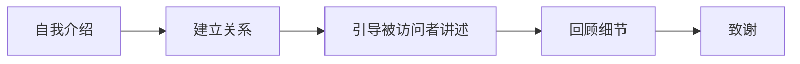

# 访谈视频文字稿及大纲
## 任务概述
- 请各组围绕拟选标题进行访谈，访谈内容包括：挖掘感受、选 2-3 个对象、列出大纲
- 基本步骤：

## 小组选题
“当代年轻打工人的生存窘境” ：这或许不是一个容易做的问题，但却是一个我们绝大多数人都无法回避的问题。我们只是在讨论一个即将面对的问题，并尽可能地找寻一个“最优解”。
## 需探明的问题
当代年轻打工人对于生活、生活质量、物质生活及精神生活等的认知。我们需要从表象着手，引导访谈对象说出其生活细节，并在这些细节的基础上深入探索其对生活的认知水平。例如，可以询问伙食、住宿、交通、娱乐、学习、工作等方面的细节，在获取以上信息后，可以进一步询问访谈对象对于这些细节的认知，以及对于生活的总体认知。最后，可以询问访谈对象对于生活的期待，以及对于未来的展望。

1. 自我介绍：欢迎您参加我们的访谈，我们是来自skd的学生，我们的访谈主题是“当代年轻打工人的生存窘境”，我们希望您能够在访谈中畅所欲言。
2. 问题1：
   - 您的工作是什么？您的工作内容是什么？您的工作地点在哪里？您的工作时间是什么时候？
   - 您的工作收入是多少？您的工作收入是否满意？您的工作收入是否能够满足您的生活需求？
   - 您的工作是否有保障？您的工作是否有发展前景？
   - 您的工作是否有压力？您的工作是否有危险？
3. 问题2：
   - 您的总体生活费用是多少？大约占工资的百分比是多少？
   - 您的伙食是怎么解决的？周伙食费用大约是多少？如果是自己做饭，您的做饭时间做饭条件是怎么样的？
   - 您的住宿是怎么解决的？您是否与别人合租？住宿条件是否满意？能否获得足够的个人隐私、休息时间？
   - 您觉得一天当中最开心的事情是什么？您觉的一天当中最放松时间段是几点到几点？
4. 问题3:
   - 您理想中的生活是什么样的？现在的生活是否符合您的理想？如果不满意，您认为是什么原因造成的？
   - 请问除了工作之外，您还有其他的爱好吗？您的爱好是否能够得到满足？
   - 您对买房购车婚姻生育等方面的看法是什么？您对未来的展望是什么？如果完全不考虑上述因素，您的理想生活是什么样的？
   - 您对于未来的展望是什么？您对于未来的展望是否能够实现？
   - 在工作或生活中，您最担心或者说最害怕发生的事情是什么？
5. 致谢：非常感谢您参加我们的访谈，我们会对您的信息进行保密，您的信息将不会被泄露。如果您对我们的访谈内容有任何异议，您可以随时联系我们，我们会及时对访谈内容进行修改。再次感谢您参加我们的访谈，祝您生活愉快，工作顺利，再见。
