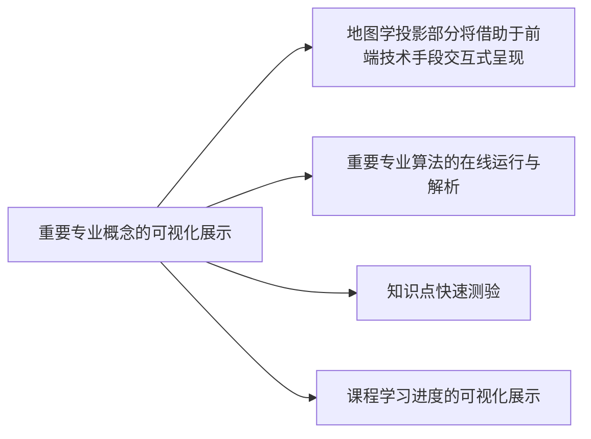
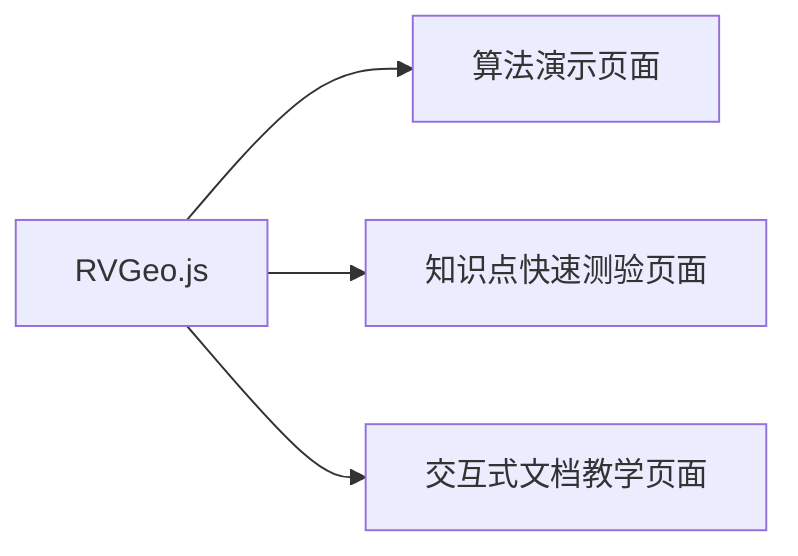
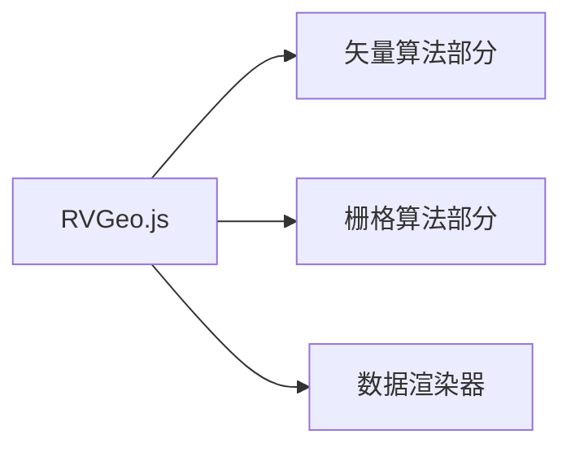
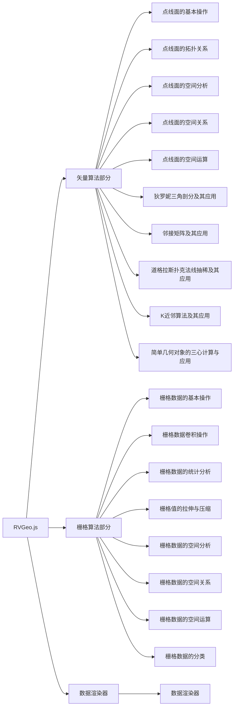
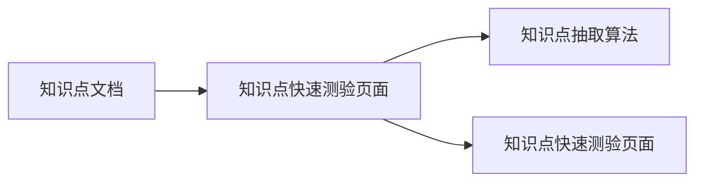

# 面向地理信息本科生的互动式教学平台    
## 软件验证材料

### 概述
地理信息专业教学注重实践并且与可视化息息相关，传统的课堂教学难以生动地呈现地理信息学的抽象概念，本软件旨在通过前端技术灵活生动地呈现原本抽象晦涩的书本知识，进一步提升教学效果。例如，一些地信领域的经典算法往往需要利用可视化、交互式的方式进行讲解，传统的课堂教学固然可以解释算法的原理，但是难以生动地展示算法的运行过程，故而这一块的教学成了地信专业教学的痛点。本软件基于现代浏览器技术，通过javascript实现了重要的地理信息算法，可以直接在浏览器中运行调试。本软件还可以根据静态知识点文档，利用javascript算法抽取生成quiz（随堂测验）。

本软件的主要功能包括：
- 重要专业概念的可视化展示（例如地图学投影部分将借助于前端技术手段交互式呈现）
- 重要专业算法的在线运行与解析（重要的地理信息算法（部分）使用javascript实现，可以直接在浏览器中运行调试）
- 知识点快速测验（根据静态知识点文档，利用javascript算法抽取生成quiz（随堂测验））
- 课程学习进度的可视化展示

本软件主要由以下几个部分组成：
- `RVGeo.js` 核心算法库，包含了重要的地理信息算法的javascript实现
- 基于`RVGeo.js`的算法演示页面，包含了重要的地理信息算法的javascript实现，可以直接在浏览器中运行调试
- 基于`Vue.js`的知识点快速测验页面，根据静态知识点文档，利用javascript算法抽取生成quiz（随堂测验） 
- 基于`Vue.js`的交互式文档教学页面

### RVGeo 算法库
`RVGeo.js`是一个基于javascript的地理信息算法库，包含了重要的地理信息算法的javascript实现，可以直接在浏览器中运行调试。为了贴合地理信息专业的教学实际，本算法库分为栅格算法和矢量算法两个部分。以下是该算法库的结构图：

该算法库的组织架构如下图所示：

#### 矢量算法部分
该部分算法基于一般的矢量数据结构，包括点、线、面等，主要包括以下几个部分：
- 点线面的基本操作
- 点线面的拓扑关系
- 点线面的空间分析
- 点线面的空间关系
- 点线面的空间运算
- 狄罗妮三角剖分及其应用
- 邻接矩阵及其应用
- 道格拉斯扑克法线抽稀及其应用
- K近邻算法及其应用
- 简单几何对象的三心计算与应用
> 考虑到地理信息专业的教学实际，本算法库的矢量算法部分主要基于二维平面，不涉及三维空间。

#### 栅格算法部分
该部分算法基于一般的栅格数据结构，主要包括以下几个部分：
- 栅格数据的基本操作
- 栅格数据卷积操作
- 栅格数据的统计分析
- 栅格值的拉伸与压缩
- 栅格数据的空间分析
- 栅格数据的空间关系
- 栅格数据的空间运算
- 栅格数据的分类

#### 数据渲染器
为了方便地理信息专业的教学实际，本算法库还包含了一个简单的数据渲染器，可以将栅格数据或矢量数据交互式地渲染到canvas上。一般的算法教学课程及资料无法直观地展示算法的运行结果，而本数据渲染器可以将算法的运行结果直观地展示出来，有利于学生理解算法的运行过程。该部分主要包括以下几个部分：
- 矢量数据的渲染
- 栅格数据的渲染
- 统计图表的渲染

### 知识点快速测验页面
该页面是一个基于`Vue.js`的知识点快速测验页面，根据静态知识点文档，利用javascript算法抽取生成quiz（随堂测验） 。该页面的组织架构如下图所示：

#### 软件功能

1. 从静态知识点文档中抽取知识点并生成随堂测验
    
2. 用户成绩排名
   
3. 用户成绩统计分析
    

### 知识点交互式教学文档
该页面是一个基于`Vue.js`的知识点交互式教学文档，利用组件式编程思想，将知识点文档中的知识点转化为交互式的知识点，从而提高学生的学习兴趣。该页面的组织架构如下图所示：

#### 交互式教学文档页面
1. 知识点文档：可以利用滑块等方式与用户交互，增强用户体验
    
    
    
2.课堂知识点整理：该部分详细地介绍了课堂知识点，包括知识点的定义、知识点的基本概念、知识点的基本性质、知识点的基本算法、知识点的应用等
    
#### 基础样例页面
该部分将一些基础用法集成在一个页面，借助于浏览器的调试功能，用户可以自行测试不同的功能，为想进一步深入理解算法的用户提供了一个测试平台。

## 总结
本项目是一个基于`Vue.js`的知识点交互式教学文档，主要包括以下几个部分：
- 知识点快速测验页面
- 知识点交互式教学文档
- 基础样例页面
- 知识点文档
- 知识点抽取算法
- 知识点交互式教学文档
- 知识点快速测验页面
- 知识点交互式教学文档
- 基础样例页面

## 项目结构

## 项目部署
1. 项目可以在本地运行，也可以部署到服务器上运行
2. 项目部署到服务器上运行，需要将项目打包成静态文件，然后将静态文件部署到服务器上即可

## 软件著作权网站填写内容
    1. 开发硬件环境: 个人笔记本电脑
    2. 运行的硬件环境: Chrome 112.0.5615.137 (arm64) 
    3. 开发软件的操作系统; Macos 13.3.1 (22E261)
    4. 软件开发环境/开发工具: VScode
    5. 软件的运行平台/操作系统: 现代浏览器
    6. 软件运行支撑环境/支持软件: Chrome 112.0.5615.137 (arm64) 
    7. 编程语言（选项）: JavaScript HTML 
    8. 源程序量（行）: 3000
    9. 开发目的 : 面向地理信息本科生的互动式教学平台，通过前端技术灵活生动地呈现原本抽象晦涩的书本知识，进一步提升教学效果。
    10. 面向领域/行业 : 教育行业 本科生专业教育 地理信息领域
    11. 软件的主要功能:
        - 重要专业概念的可视化展示（例如地图学投影部分将借助于前端技术手段交互式呈现）
        - 重要专业算法的在线运行与解析（重要的地理信息算法（部分）使用javascript实现，可以直接在浏览器中运行调试）
        - 知识点快速测验（根据静态知识点文档，利用javascript算法抽取生成quiz（随堂测验））
    12. 软件的技术特点: 教育软件（面向地理信息专业学生的互动式教学软件）